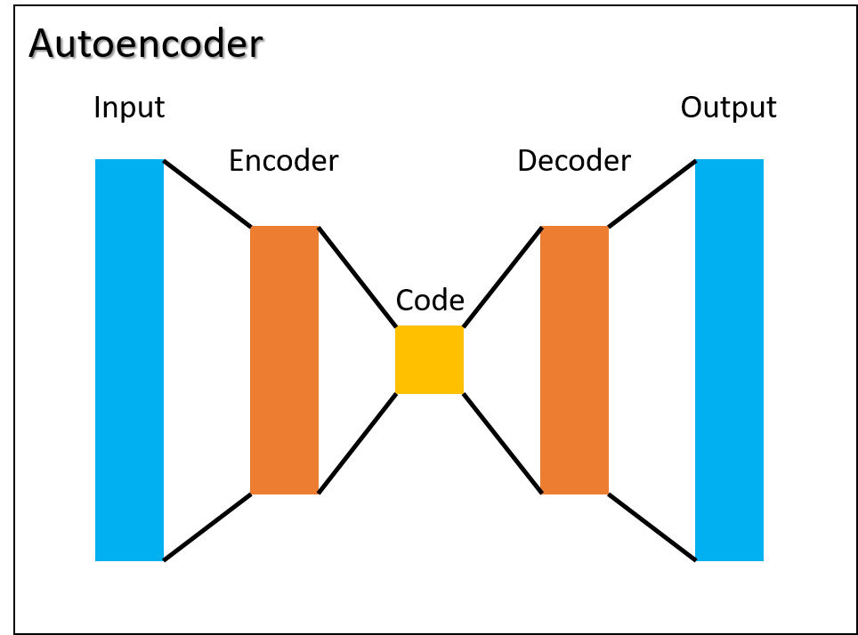

# Denoising Images using Autoencoders

## Description:

[**Autoencoders**](https://www.simplilearn.com/tutorials/deep-learning-tutorial/what-are-autoencoders-in-deep-learning) are a type of `Deep Learning` algorithm that are designed to receive an input and transform it into a different representation and **learn** during the _training_ process how to reconstruct the original input given just a compressed version of it.

To explore the capability of an Autoencoder to _learn_ a simplified version of the input data, we use images of handwritten digits and introduce `noise` into the images by **occlusion** of a section of the image. The Autoencoder is then tested on how well it removes the `noise`, reconstructing the image using the reduced interpretation learned previously.

**Keywords: `Image Processing,` `Dimensionality Reduction,` `Deep Learning,` `Autoencoders`**

<br>
<p align="center">

<br>
<i>Reconstruction of occluded images with an Autoencoder</i>
</p>
<br>

## Requirements:

- Python 3.9.17
- numpy
- matplotlib
- pytotch

**Interested in running the experiment by yourself?**  
Download the `environment.yaml` file. Navigate to the directory that contains the file and run the next command in your `Anaconda` distribution:

```shell
conda env create -f environment.yaml
```

Once the installation is done run:

```shell
conda activate dl
```

## Layers in an Autoencoder:

It can be notice that the number of nodes in the `input layer` is the same as in the `output layer`. Let's say that the number of nodes in the the input or output layer is $K$, the number of nodes in the encoder or decoder layer is $N$, and the number of nodes in the code layer is $M$, then we can state that $K>N>M$, so the code layer is a representation of the input in a reduced form and the output is a `construction` from this simpler form into an equivalent of the original input.

<p align="center">

<br>
<i>Autoencoder architecture</i>
</p>
<br>

## The Dataset:

To run the experiment, we are recycling the old [MNIST dataset](https://en.wikipedia.org/wiki/MNIST_database) which is a set of images of handwritten digit. The dataset is divided in _train_ and _test_ along its labels. Both datasets can be found in the _Data_ folder.

First the Autoencoder is trained with the original images from the _train_ dataset. Then, `noise` is added into the _test_ dataset images by occlusion of a section of the image in order to test the ability of the Autoencoder to remove the `noise`, reconstructing the image using the reduced interpretation learned previously.

## Appling Occlusion to Images:

To add noise to the images a section (rows or columns of pixels in each image) is selected randomly and its intensity is set to one, giving as a result an **occluded** section in the original image.

```python
for i in range(X.shape[0]):

  # reshape the image
  image = X[i,:].view(28,28)

  # occlude random rows or columns
  startloc = np.random.choice(range(10,21))
  if i%2==0: # even -> horizontal occlusion
    image[startloc:startloc+1,:] = 1
  else:      # odd -> vertical occlusion
    image[:,startloc:startloc+1] = 1
```

<p align="center">

<br>
<i>Examples of images with occlusion applied</i>
</p>
<br>

## Autoencoder Architecture:

The selection of the layers' sizes for an Autoencoder is straight forward, due to the input layer is based on the size of the input vector and the encoder and code layers are normally reduced in size of the previous layer.

For our Autoencoder the _input_ layer is **784** due to each image is **28x28.** The _encoder_ layer is **128,** which is a reduction of **~6.13.** And the _code_ layer is **50.**

```python
class AEnet(nn.Module):
    def __init__(self):
      super().__init__()

      ### input layer
      self.input = nn.Linear(784,128)
      ### encoder layer
      self.enc = nn.Linear(128,50)
      ### Code layer
      self.lat = nn.Linear(50,128)
      ### decoder layer
      self.dec = nn.Linear(128,784)
```

## Testing the Autoencoder:

To test the performance of our Autoencoder, all _test_ images were modified by the **occlusion algorith,** and the noisy images were fed to the Autoencoder.

The next figure shows the original images in the _test_ dataset, followed by the occluded images and finally the images reconstructed by the Autoencoder.

<p align="center">

<br>
<i>Performance test: First row appear the original images, second row appear the occluded images, and third row the reconstructed images by the Autoencoder</i>
</p>
<br>
